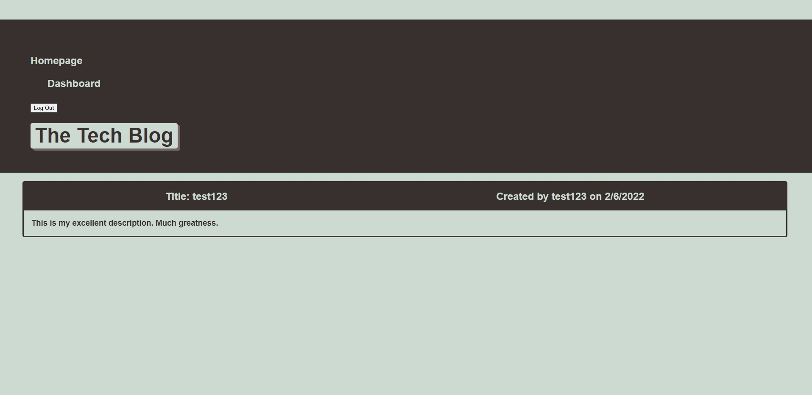

# Tech Blog

## Table of Contents

- [Description](#description)
- [Installation](#installation)
- [Usage](#usage)
- [Tests](#tests)
- [Contributing](#contributing)
- [Questions](#questions)

## Live URL
[Tech Blog URL](https://desolate-dawn-08072.herokuapp.com/)

## Screenshot

 ## Description

The purpose of the application is to The purpose of this app is to serve as an updatable blog for users to submit, edit, and comment on posts with login functionality.
 
## Installation

None, app is deployed on a live url

## Usage

Click the url, log in, and you're on your way

## Tests

I can't for the life of me to get the navbar items to display in a row

## Contributing

Don't

## Questions

My GitHub username is: karpx033

Link @ https://github.com/karpx033

Email: karpx033@umn.edu

Got Questions? 
Send me an email

